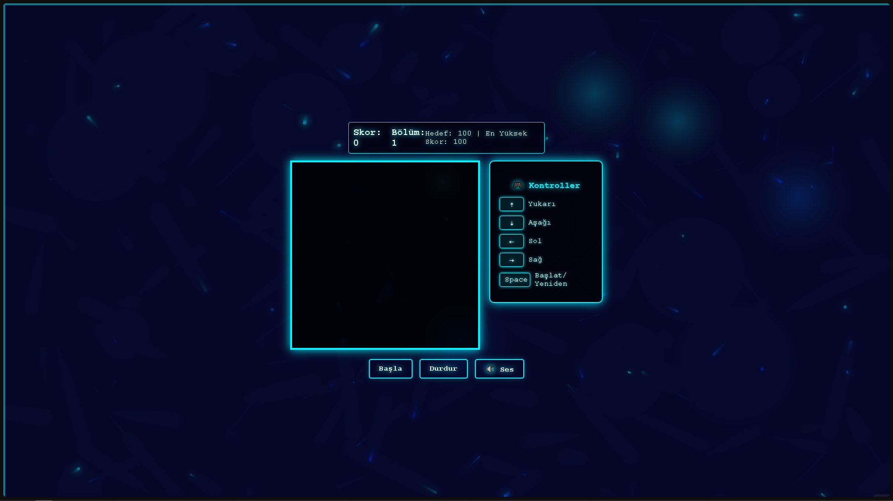
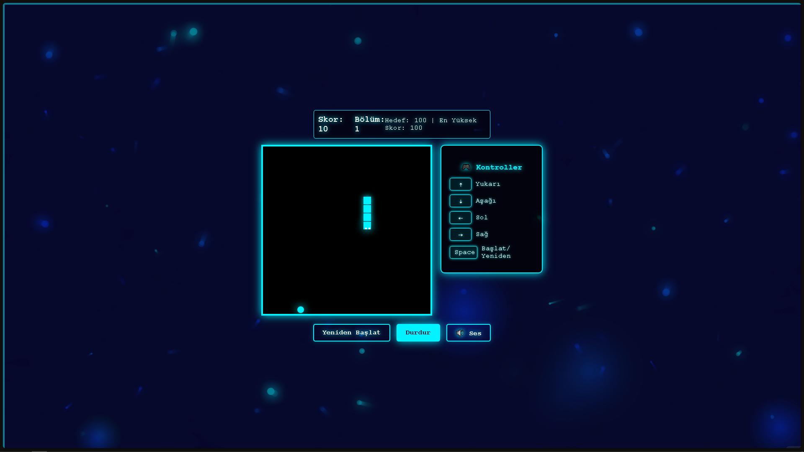
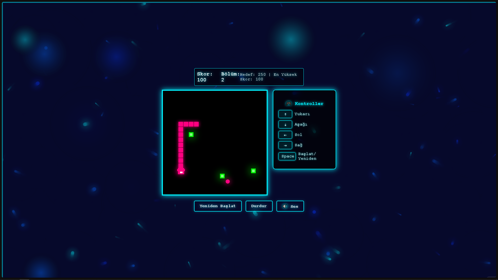

# 🎮 Neon Snake Game

  
  
  [🕹️ Hemen Oyna](https://sadecemertcan.github.io/neon-snake) | [🌟 Yüksek Skorlar](https://sadecemertcan.github.io/neon-snake/scores) | [🎵 Ses Açık/Kapalı](https://sadecemertcan.github.io/neon-snake)

## 📝 Oyun Hakkında

Modern ve neon tarzında tasarlanmış, klasik yılan oyununun gelişmiş bir versiyonu. Üç farklı zorluk seviyesi, özel efektler ve müzikler ile benzersiz bir oyun deneyimi sunar.

### 🌟 Özellikler

- 🎨 Neon tarzında modern tasarım
- 🎯 Üç farklı zorluk seviyesi:
  - 🟦 Seviye 1: Neon Yılan (Başlangıç)
  - 🟪 Seviye 2: Ejderha (Orta)
  - 🟨 Seviye 3: Işık Hızı (Zor)
- ✨ Dinamik arkaplan ışık efektleri
- 🎵 Özel ses efektleri ve müzik
- 📊 Yüksek skor takibi
- 💾 Otomatik ilerleme kaydı

### 🎮 Nasıl Oynanır?

| Tuş | İşlev |
|-----|-------|
| ↑ | Yukarı git |
| ↓ | Aşağı git |
| ← | Sola git |
| → | Sağa git |
| SPACE | Başlat/Yeniden Başlat |

## 🎯 Hedefler

- Her seviyede belirli bir skora ulaşarak bir sonraki seviyeye geçin
- Engellere ve duvarlara çarpmadan ilerleyin
- Yüksek skor yaparak lider tablosuna girin

## 🛠️ Teknolojiler

- HTML5 Canvas
- JavaScript (ES6+)
- CSS3 Animasyonlar
- Web Audio API

## 📱 Ekran Görüntüleri

  
  
  

## 🔄 Güncellemeler

### v1.0.0 (Mevcut Sürüm)
- İlk resmi sürüm
- Üç farklı zorluk seviyesi
- Neon efektler ve müzik sistemi

### Planlanan Güncellemeler
- [ ] Çoklu oyuncu modu
- [ ] Yeni seviyeler
- [ ] Özel güçler ve yetenekler
- [ ] Global skor tablosu

## 👨‍💻 Geliştirici

[GitHub Profilim](https://github.com/sadecemertcan)

## 🤝 Katkıda Bulunma

1. Bu repository'yi fork edin
2. Yeni bir branch oluşturun (`git checkout -b yeni-ozellik`)
3. Değişikliklerinizi commit edin (`git commit -am 'Yeni özellik eklendi'`)
4. Branch'inizi push edin (`git push origin yeni-ozellik`)
5. Pull Request oluşturun

## 📜 Lisans

Bu proje MIT lisansı altında lisanslanmıştır. Detaylar için [LICENSE](LICENSE) dosyasına bakın. 